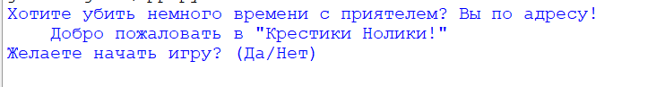
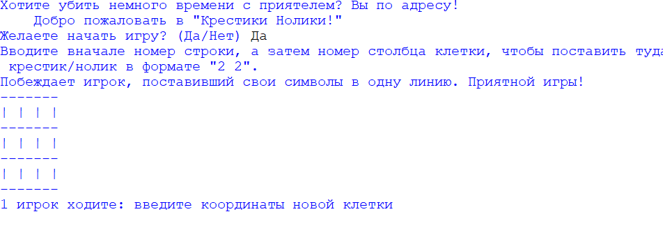
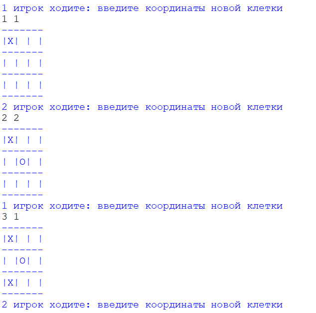
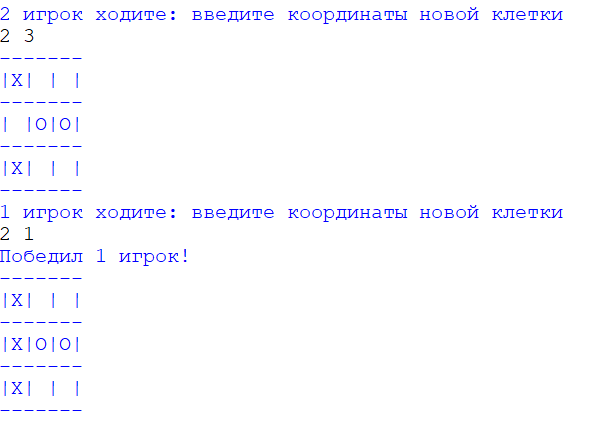

# Отчёт об игре "Tic tac toe"
## Работу выполнил Горинов Павел из ТРПО24-2
## Задание:
    Реализовать программу, при помощи которой 2 игрока могут играть в «Крестики-нолики» на поле 3 на 3. Взаимодействие с программой производится через консоль. Игровое поле изображается в виде трех текстовых строк и перерисовывается при каждом изменении состояния поля. При запросе данных от пользователя программа сообщает, что ожидает от пользователя (в частности, координаты новой отметки на поле) и проверяет корректность ввода. Программа должна уметь автоматически определять, что партия окончена, и сообщать о победе одного из игроков или о ничьей. Сама программа НЕ ходит, т.е. не пытается ставить крестики и нолики с целью заполнить линию.
## Работа программы
1) Вначале программа спрашивает у пользователя, хочет ли он сыграть

2) Если пользователь соглашается, то ему кратко объясняются правила. Затем отрисовывается поле и игроки по очереди ставят крестики/нолики.

3) Когда три одинаковых символа выстраиваются в линию, игрок побеждает и выводится сообщение о победе
